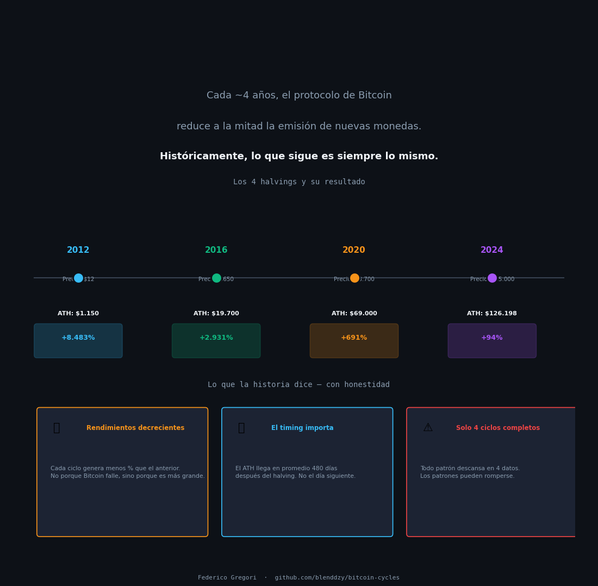
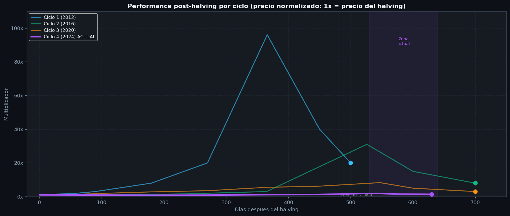
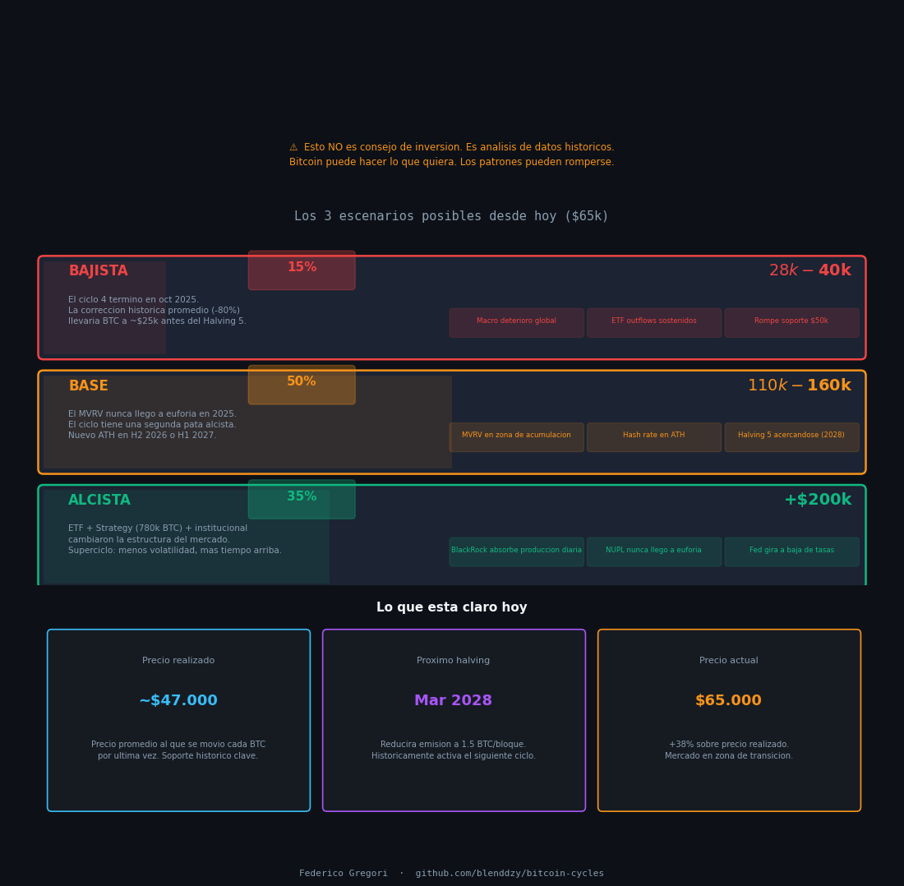

# ₿ Bitcoin: Ciclos Históricos, Halvings y Proyección 2026–2028

Análisis de los 4 ciclos completos de Bitcoin usando datos históricos de precio  
y métricas on-chain, con proyección de escenarios hasta el Halving 5 (2028).

> ⚠️ Este análisis es educativo. No es consejo de inversión.

---



---

## 🎯 Pregunta central

Bitcoin tocó un ATH de **$126.198** en octubre de 2025.  
Hoy (junio 2026) cotiza en **~$65.000** — una corrección del **-48%**.

¿Estamos ante el inicio de un bear market prolongado, o el ciclo tiene una segunda pata?

---

## 📊 Análisis incluidos

| # | Análisis | Insight clave |
|---|----------|---------------|
| 1 | Historia de precio + 4 halvings (escala log) | Cada ciclo tiene la misma forma, distinto tamaño |
| 2 | Rendimientos por ciclo — diminishing returns | Ciclo 1: +8.483%. Ciclo 4: +94%. La madurez del activo |
| 3 | Overlay de ciclos normalizados | El Ciclo 4 es el más débil en multiplicador, pero el mayor en precio absoluto |
| 4 | Dashboard on-chain (MVRV, NUPL, SOPR, Hash Rate) | MVRV en 0.22: zona históricamente de acumulación |
| 5 | Proyección 2026–2028 con 3 escenarios | Base: $110k–$160k. Bajista: $28k–$40k. Alcista: +$200k |

---



---

## 🔍 Hallazgos principales

**1. El Ciclo 4 fue estructuralmente diferente — no necesariamente terminado.**  
El MVRV Z-Score nunca superó 2.5 en 2025, cuando el umbral histórico de "euforia" es 3.5+.  
Eso sugiere que o el activo maduró (menos volatilidad = menos euforia) o la segunda pata aún no llegó.

**2. El timing histórico da margen.**  
Los ATH de ciclos anteriores llegaron entre 366 y 547 días post-halving (promedio: 480 días).  
El ATH del Ciclo 4 llegó a los 535 días — dentro del rango histórico.  
El Halving 5 está proyectado para marzo 2028.

**3. Los niveles de precio a monitorear:**
- **$47.000** — Precio realizado. Soporte histórico crítico.
- **$65.000** — Zona actual. Acumulación o distribución.
- **$126.198** — ATH anterior. Superarlo confirma nueva fase.

**4. Advertencia metodológica:**  
Todo este análisis descansa en **4 ciclos completos**. Es muy poco para afirmar que un patrón es ley. Los patrones pueden romperse.

---



---

## 🗂️ Estructura del proyecto

```
bitcoin-cycles/
├── assets/                          # Imágenes para el README
├── data/
│   └── raw/
│       ├── halving_history.csv      # Los 4 halvings con precios y retornos
│       ├── price_monthly.csv        # Precio mensual 2011–2026
│       └── onchain_metrics.csv      # MVRV, NUPL, SOPR, Hash Rate (jun 2026)
├── notebooks/
│   └── bitcoin_cycles_analysis.ipynb
└── outputs/
    ├── 01_precio_historico.png
    ├── 02_rendimientos_ciclos.png
    ├── 03_overlay_ciclos.png
    ├── 04_onchain_dashboard.png
    ├── 05_ciclo4_proyeccion.png
    └── story_0*.png                 # Imágenes resumen estilo LinkedIn
```

---

## 🔧 Stack técnico

- **Python 3.11** — pandas, matplotlib, numpy
- **Jupyter Notebook**
- **Fuentes:** Glassnode (on-chain), CoinGecko (precios), CryptoQuant, datos públicos blockchain

